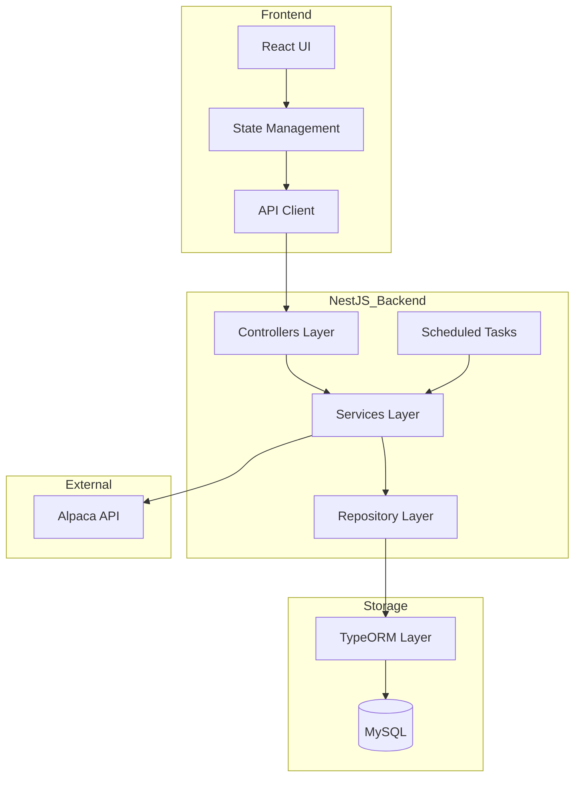

# System Patterns

## Architecture Overview

## Design Patterns
1. Module Pattern (NestJS modules)
2. Dependency Injection (NestJS providers)
3. Repository Pattern (TypeORM repositories)
4. Service Pattern (NestJS services)
5. Observer Pattern (NestJS events)
6. Strategy Pattern (Filter execution)

## NestJS-Specific Patterns
1. Module Segregation
   - Feature modules for each domain
   - Shared module for common functionality
   - Core module for app-wide services

2. Service Layer
   - Business logic encapsulation
   - Dependency injection
   - Cross-cutting concerns

3. Controller Layer
   - REST API endpoints
   - Request validation
   - Response transformation

4. Scheduled Tasks
   - Data synchronization
   - Cleanup jobs
   - Status updates

## Data Patterns
1. Repository Pattern for data access
2. Service Pattern for business logic
3. Background jobs for data fetching
4. Caching for frequent queries
