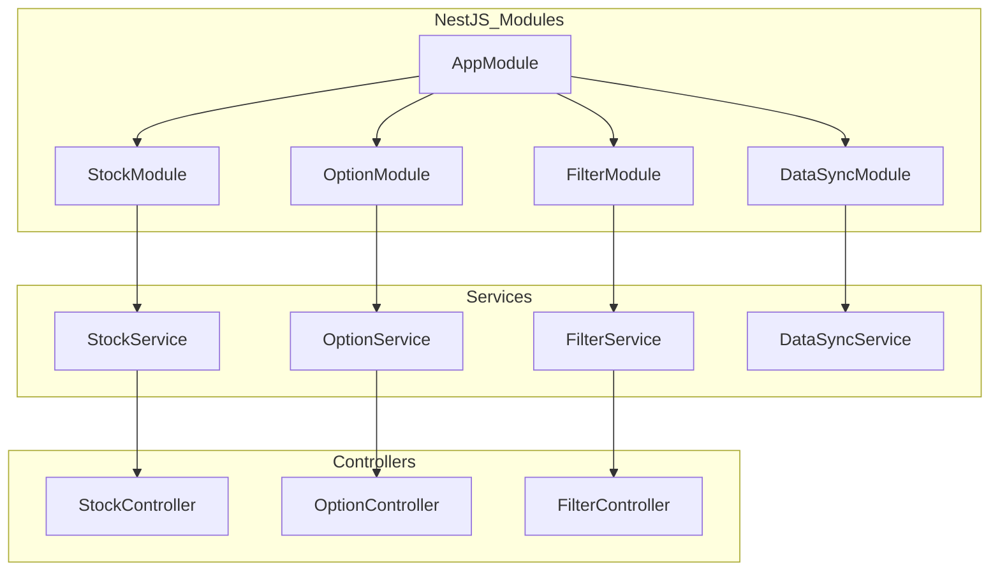

# Technical Context

## Technology Stack
1. Frontend
   - TypeScript
   - React
   - shadcn/ui component system
   - Tailwind CSS
   - Rspack for build tooling
   - Data visualization libraries

2. Backend
   - NestJS
   - TypeScript
   - Features utilized:
     - Dependency Injection
     - Modules
     - Services
     - Controllers
     - Scheduled Tasks
     - TypeORM Integration

3. Database
   - MySQL
   - TypeORM

4. External APIs
   - Alpaca Market Data API

## Data Models
1. Stock Data
   ```typescript
   interface StockBarEntity {
     id: number;
     symbol: string;
     timeframe: TimeframeEnum;
     timestamp: Date;
     open: number;
     high: number;
     low: number;
     close: number;
     volume: number;
     vwap: number;
     trade_count: number;
   }
   ```

2. Options Data
   ```typescript
   interface OptionDataEntity {
     id: number;
     symbol: string;
     expiration_date: Date;
     strike_price: number;
     option_type: 'call' | 'put';
     open_interest: number;
     volume: number;
   }
   ```

## Backend Architecture


## Module Structure
1. StockModule
   ```typescript
   @Module({
     imports: [TypeOrmModule.forFeature([StockBarEntity])],
     providers: [StockService],
     controllers: [StockController],
     exports: [StockService],
   })
   export class StockModule {}
   ```

2. DataSyncModule
   ```typescript
   @Module({
     imports: [
       TypeOrmModule.forFeature([DataSyncMetadata]),
       StockModule,
       OptionModule,
     ],
     providers: [DataSyncService],
     exports: [DataSyncService],
   })
   export class DataSyncModule {}
   ```

## Scheduled Tasks
```typescript
@Injectable()
export class DataSyncService {
  @Cron('0 */1 * * * *') // Every hour
  async syncHourlyData() {
    // Sync hourly data
  }

  @Cron('0 0 * * * *') // Every day at midnight
  async syncDailyData() {
    // Sync daily data
  }
}
```

## Frontend Architecture
1. Build System
   - Rspack for faster builds
   - TypeScript configuration
   - Path aliases

2. UI Components
   - shadcn/ui component system
   - Tailwind CSS for styling
   - Radix UI primitives (via shadcn)

3. Key Features
   - Themeable components
   - Accessible by default
   - Type-safe components
   - Server-side rendering ready

## Development Setup
1. Node.js environment
2. MySQL database
3. TypeORM CLI
4. Alpaca API credentials
5. Tailwind CSS setup
6. Rspack configuration
